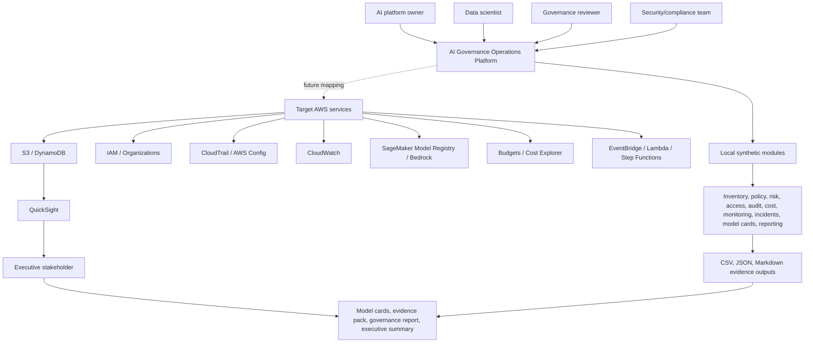

# Architecture Diagram

This diagram is documentation only. The repository remains local and synthetic and does not provision AWS resources.

```mermaid
flowchart TD
    Owner["AI platform owner"]
    DS["Data scientist"]
    Reviewer["Governance reviewer"]
    Security["Security/compliance team"]
    Exec["Executive stakeholder"]

    Platform["AI Governance Operations Platform"]
    Local["Local synthetic modules"]
    Inventory["Inventory, policy, risk, access, audit, cost, monitoring, incidents, model cards, reporting"]
    AWS["Target AWS services"]
    IAM["IAM / Organizations"]
    Trail["CloudTrail / AWS Config"]
    Watch["CloudWatch"]
    ML["SageMaker Model Registry / Bedrock"]
    Cost["Budgets / Cost Explorer"]
    Workflow["EventBridge / Lambda / Step Functions"]
    Store["S3 / DynamoDB"]
    BI["QuickSight"]
    Evidence["CSV, JSON, Markdown evidence outputs"]
    Reports["Model cards, evidence pack, governance report, executive summary"]

    Owner --> Platform
    DS --> Platform
    Reviewer --> Platform
    Security --> Platform
    Exec --> Reports

    Platform --> Local
    Local --> Inventory
    Inventory --> Evidence
    Evidence --> Reports

    Platform -. future mapping .-> AWS
    AWS --> IAM
    AWS --> Trail
    AWS --> Watch
    AWS --> ML
    AWS --> Cost
    AWS --> Workflow
    AWS --> Store
    Store --> BI
    BI --> Exec
```
