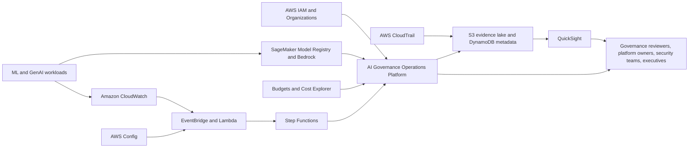
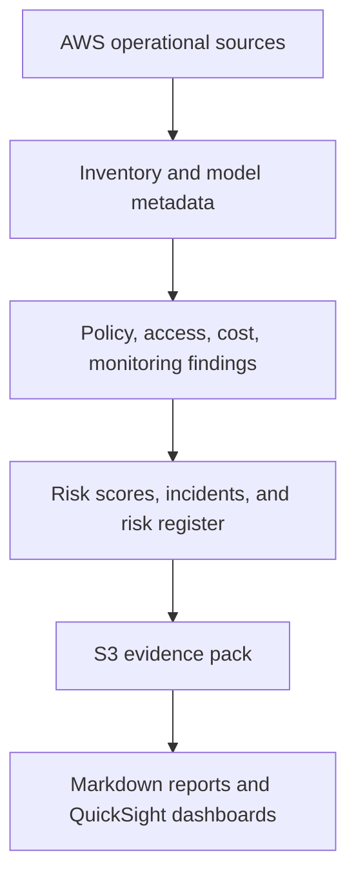
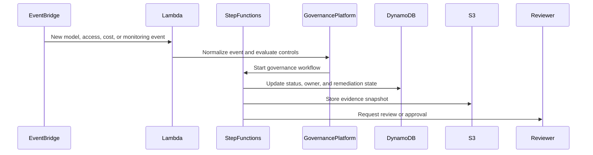

# AWS Architecture

## Architecture Overview

This repository is a local and synthetic AWS-oriented AI Governance & Operations Platform. It does not connect to AWS, create AWS resources, call AWS APIs, or provision infrastructure. The AWS architecture described here is design documentation that explains how the local modules could map to a future real AWS implementation.

The target architecture would combine metadata storage, event ingestion, governance policy checks, risk scoring, access review, monitoring, cost controls, incident tracking, and reporting into a governed operating layer for ML and GenAI systems.

## Target AWS Account Model

A production implementation would use a multi-account model:

- Management account: AWS Organizations, account structure, and guardrail governance.
- Shared services account: central evidence storage, reporting, workflow automation, and dashboards.
- Workload accounts: SageMaker, Bedrock, application workloads, monitoring, and audit sources.
- Security/audit account: CloudTrail aggregation, AWS Config aggregation, security review, and evidence retention.

## High-Level Component Diagram

## Data/Evidence Flow Diagram

## Control Flow Diagram

## Service-By-Service Responsibilities

| AWS service | Responsibility |
| --- | --- |
| AWS IAM | Principals, roles, service roles, MFA posture, least privilege review |
| AWS Organizations | Account context, organizational units, multi-account governance |
| AWS CloudTrail | Audit event source for access, model, approval, and configuration activity |
| Amazon CloudWatch | Metrics, logs, alarms, latency, error, availability, and alerting signals |
| AWS Config | Configuration compliance and control evidence |
| Amazon S3 | Evidence lake, report storage, model cards, exported artifacts |
| Amazon SageMaker Model Registry | ML model catalogue, approval status, package metadata |
| Amazon Bedrock | GenAI workload metadata, guardrail signals, prompt/agent governance context |
| AWS Budgets | Budget thresholds and notifications |
| AWS Cost Explorer | Cost and usage analytics |
| Amazon EventBridge | Event routing for governance workflows |
| AWS Lambda | Lightweight checks, normalization, enrichment, and automation |
| Amazon DynamoDB | Current-state records for inventory, findings, incidents, and risk registers |
| AWS Step Functions | Human-in-the-loop governance workflows and remediation tracking |
| Amazon QuickSight | Executive and operational reporting dashboards |

## Local Module Mapping

The local modules map conceptually to AWS sources and workflows:

- `inventory`: DynamoDB, S3, SageMaker Model Registry, Bedrock.
- `policy_checks`: AWS Config, Lambda, EventBridge.
- `risk_scoring`: Lambda, DynamoDB, Step Functions.
- `access_review`: IAM, Organizations, CloudTrail.
- `audit`: CloudTrail, CloudWatch, S3.
- `cost_management`: Budgets, Cost Explorer.
- `monitoring`: CloudWatch, SageMaker Model Monitor, Bedrock guardrails.
- `incident_management`: Step Functions, DynamoDB, EventBridge.
- `model_cards` and `reporting`: S3, QuickSight, SageMaker Model Registry.

## Security And Access Control Model

The target design would use least privilege IAM roles, separate read/write roles for evidence stores, reviewer roles for governance workflows, and service roles for automation. Sensitive evidence would be stored in encrypted S3 buckets with lifecycle policies, access logging, and explicit separation between workload accounts and the central governance account.

## Audit And Evidence Model

CloudTrail, CloudWatch, AWS Config, SageMaker, Bedrock, cost, and workflow outputs would be normalized into evidence records. S3 would provide immutable or retention-controlled evidence storage. DynamoDB would hold current-state summaries and references to evidence objects.

## Monitoring And Alerting Model

CloudWatch alarms, SageMaker monitoring outputs, Bedrock guardrail signals, and EventBridge rules would trigger checks and workflow updates. Monitoring would cover system health, latency, errors, availability, drift, quality, and guardrail outcomes.

## Cost Governance Model

Budgets and Cost Explorer would provide cost thresholds, trend analysis, and account/service-level spend signals. The governance layer would map spend back to AI systems, cost centers, owners, and remediation records.

## Incident And Risk Workflow

Policy failures, access issues, audit failures, monitoring degradation, cost anomalies, and high risk scores would create incidents and risk register entries. Step Functions would orchestrate owner review, remediation, acceptance, closure, and evidence attachment.

## Reporting Workflow

Reports would combine data from DynamoDB current-state records and S3 evidence snapshots. QuickSight could provide dashboards, while S3 could retain Markdown/PDF evidence packs and model cards.

## Limitations Of The Current Local MVP

The current repository is local and synthetic. It creates no AWS resources, uses no real AWS data, and does not call IAM, CloudTrail, CloudWatch, AWS Config, SageMaker, Bedrock, Budgets, Cost Explorer, EventBridge, Lambda, DynamoDB, Step Functions, S3, or QuickSight APIs.

## Future Real-AWS Implementation Path

A future implementation could add infrastructure-as-code, AWS API ingestion, central evidence storage in S3, current-state records in DynamoDB, EventBridge/Lambda automation, Step Functions review workflows, and QuickSight dashboards. That future implementation should include security review, data classification, encryption, retention policies, IAM least privilege, and operational runbooks before production use.
