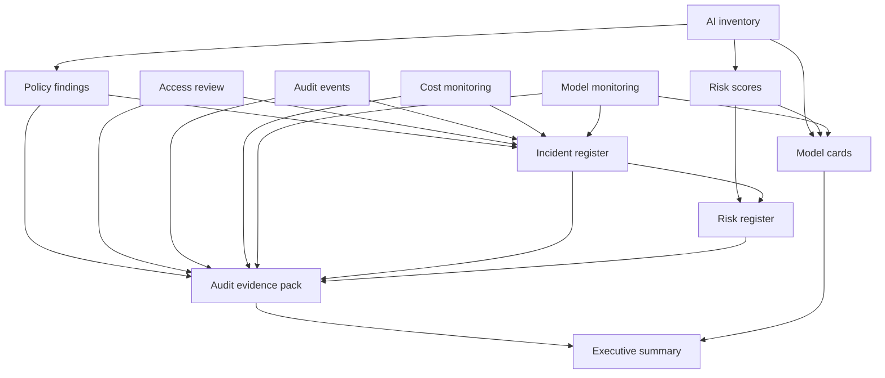

# Evidence Flow

The current evidence flow is local and synthetic. It creates local CSV, JSON, and Markdown files only. It does not collect real AWS evidence or create AWS resources.

## Source Data

- Inventory records
- Policy findings
- Risk scores
- Access review records
- Audit events
- Cost monitoring records
- Model monitoring records
- Incident register
- Risk register
- Model cards

## Evidence Outputs

- CSV files under `outputs/`
- JSON files under `outputs/`
- Markdown reports under `reports/`
- Markdown model cards under `reports/model_cards/`
- Audit evidence pack
- Executive summary

## Evidence Flow Diagram

## Governance Use

Evidence movement allows teams to trace a governance report back to the synthetic source records that produced it. In a real AWS implementation, S3 object references, CloudTrail event IDs, CloudWatch alarm IDs, Config evaluation IDs, and workflow execution IDs would replace local file references.
