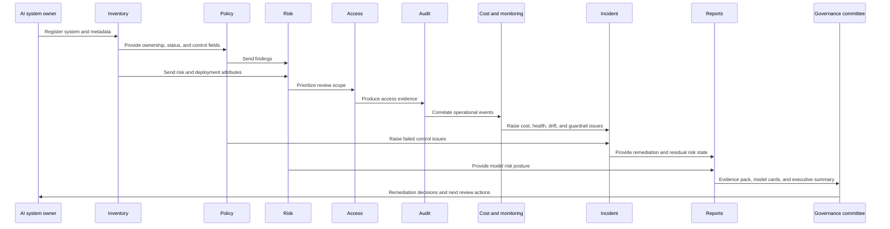

# Operational Workflow

This workflow is local and synthetic in the current repository. It does not connect to AWS or create AWS resources. It documents how the implemented modules could become an AWS-oriented AI governance operating cycle.

## End-To-End Workflow

1. Register AI system in the inventory.
2. Assign owner, business unit, lifecycle status, deployment environment, and risk tier.
3. Run governance policy checks.
4. Calculate risk score.
5. Review access and least privilege posture.
6. Capture audit events for model, access, approval, monitoring, and governance activity.
7. Monitor cost and threshold status.
8. Monitor system health, drift, quality, latency, errors, guardrails, and availability.
9. Generate incidents from failed or degraded signals.
10. Update the model risk register.
11. Generate model cards.
12. Generate evidence pack and executive report.
13. Review remediation and accepted risks.
14. Repeat governance cycle.

## Sequence Diagram

## Governance Cadence

| Cadence | Activity |
| --- | --- |
| Daily | Monitor health, alerts, cost anomalies, guardrail spikes, and critical incidents. |
| Weekly | Review open incidents, high-risk findings, and remediation progress. |
| Monthly | Review access, privileged permissions, cost thresholds, and evidence completeness. |
| Quarterly | Review model cards, risk register entries, accepted risks, and policy changes. |
| Quarterly | Run risk committee review for high and critical AI systems. |

## Production Workflow Pattern

A production AWS implementation could use EventBridge for triggers, Lambda for checks, Step Functions for human approval and remediation workflows, DynamoDB for current state, and S3 for evidence. QuickSight could provide dashboards for governance, risk, compliance, platform, and executive stakeholders.
